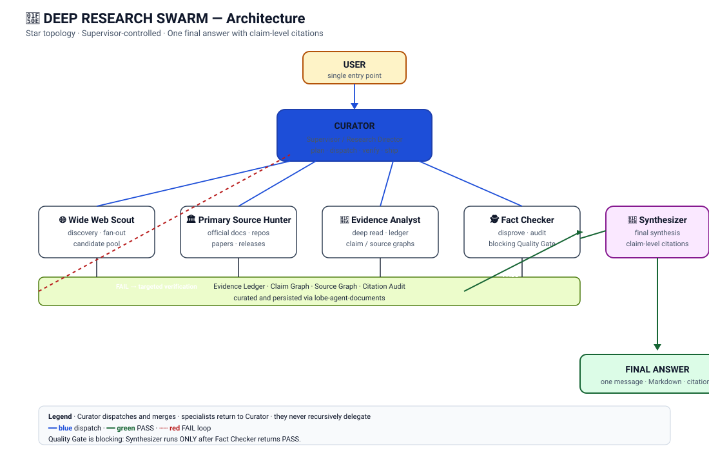

# 🔎 DEEP RESEARCH SWARM

**A multi-agent deep-research system for LobeHub.**  
Search wide → verify primary sources → extract evidence → red-team claims → synthesize one citation-backed answer.

[Русский](README.ru.md) · [简体中文](README.zh-CN.md) · **English**

> **Status:** `v0.1.0-beta`  
> This is a public beta configuration/framework, not a hosted service and not an official LobeHub project.


## Why this project exists

Most "research agents" collapse several different jobs into one prompt: search, source selection, reading, verification, contradiction handling, and writing. DEEP RESEARCH SWARM splits those jobs across specialized agents coordinated by a single Curator.

The goal is not to maximize the number of agents. The goal is to create a disciplined evidence pipeline that can:

- fan out across the web, GitHub, forums, papers and official docs;
- prefer primary sources over summaries;
- keep claims tied to provenance;
- distinguish facts, source claims, community signals and hypotheses;
- detect contradictions instead of smoothing them over;
- run targeted second-pass verification when evidence is weak;
- return **one coherent final answer with real citations**.

## Architecture



```text
User
  │
  ▼
Curator / Research Director
  │
  ├──► Wide Web Scout
  │       discovery · query fan-out · candidate pool
  │
  ├──► Primary Source Hunter
  │       official docs · repos · papers · filings · release notes
  │
  ├──► Evidence Analyst
  │       deep reading · evidence ledger · claim/source graph
  │
  ├──► Fact Checker / Red Team
  │       contradiction search · citation audit · blocking quality gate
  │
  └──► Research Synthesizer
          final synthesis · uncertainty · citations · actionable answer
```

**Important:** this is a supervisor-controlled star topology. Specialists return results to the Curator; they do not recursively delegate to one another.

## The six agents

| Agent | Mission | Typical output |
|---|---|---|
| **Curator / Research Director** | Plans, routes, controls depth, merges evidence, owns the final answer | research plan, workstreams, final decision |
| **Wide Web Scout** | Finds the broad candidate space | ranked candidate pool + discovery map |
| **Primary Source Hunter** | Replaces secondary mentions with authoritative sources | verified primary-source bundle |
| **Evidence Analyst** | Reads deeply and extracts claims with provenance | evidence ledger + claim/entity/source graph |
| **Fact Checker / Red Team** | Tries to falsify claims and blocks weak synthesis | PASS/FAIL gate + targeted verification tasks |
| **Research Synthesizer** | Writes the final evidence-backed answer | concise synthesis with citations and uncertainty |

## Research modes

| Mode | Use when | Behavior |
|---|---|---|
| **QUICK** | narrow factual question | minimal agent set, fast verification |
| **STANDARD** | normal research | discovery + primary-source check + synthesis |
| **DEEP** | comparisons / technical research | multi-pass discovery, evidence analysis, red-team |
| **MAX** | high-complexity research | broader fan-out, targeted gap search, stronger audit |
| **ULTRA** | hardest / ambiguous investigations | adversarial branches, model/source cross-checking, exhaustive verification where useful |

The Curator should scale effort to the task rather than invoke the full swarm for every question.

## Installation in LobeHub

Full guide: **[docs/lobehub-setup.md](docs/lobehub-setup.md)**

### 1. Create a group
Create a new LobeHub group called **DEEP RESEARCH SWARM**.

### 2. Add the six agents
Create one Supervisor/Curator and five specialists using the prompt templates in [`agents/`](agents/).

### 3. Configure tools
Use the smallest tool set that supports each role. See [`docs/tools-and-skills.md`](docs/tools-and-skills.md).

### 4. Paste the group protocol
Use [`group/group-prompt.md`](group/group-prompt.md) as the group-level operating protocol.

### 5. Run the acceptance test
Use [`tests/acceptance-test.md`](tests/acceptance-test.md).

### 6. Start with STANDARD or DEEP
Do not enable maximum fan-out until a normal research run completes without tool-call errors.

## Evidence policy

The system separates evidence into explicit classes:

- **FACT** — directly supported by evidence.
- **SOURCE CLAIM** — a statement made by a source, attributed to that source.
- **COMMUNITY SIGNAL** — forum/Reddit/user reports; useful but not authoritative.
- **HYPOTHESIS** — plausible interpretation that still needs verification.
- **UNKNOWN** — not established by available evidence.

See **[Citation & Evidence Policy](docs/citation-and-evidence-policy.md)**.

### GitHub date semantics

When reporting repository freshness:

```text
GitHub pushed_at  → LAST_PUSH
release date      → RELEASE_DATE
commit date       → LAST_COMMIT only when an actual commit is inspected
```

Never silently relabel `pushed_at` as "last commit".

## Recommended research loop

```text
UNDERSTAND
  ↓
PLAN
  ↓
DISCOVER WIDE
  ↓
VERIFY PRIMARY SOURCES
  ↓
EXTRACT EVIDENCE
  ↓
RED-TEAM / CONTRADICTION CHECK
  ↓
GAP SEARCH (only if needed)
  ↓
QUALITY GATE
  ↓
SYNTHESIZE ONCE
```

The final answer should be produced once, after the evidence state is good enough for the selected mode.

## Example query

```text
Find the best current open-source alternatives to Perplexity for deep research.

Requirements:
- separate local vs cloud options;
- verify GitHub repository freshness;
- compare installation complexity, citations, agentic search and Windows support;
- inspect official docs and repository issues;
- distinguish confirmed facts from community reports;
- recommend the top 3, not a directory of 50 projects.

Mode: DEEP.
```

More examples: [`examples/`](examples/).

## Output quality rules

A strong final report should:

1. answer the user's actual decision, not dump raw research;
2. cite material claims;
3. prefer primary sources;
4. surface meaningful contradictions;
5. label unknowns rather than invent details;
6. avoid unsupported negative claims ("project X does not support Y") unless verified;
7. distinguish Windows-native, WSL, Docker and cloud deployment paths;
8. state degraded-mode behavior when one workstream fails;
9. compress duplicate evidence;
10. provide a clear recommendation when the user asked for one.

## Stable-mode fallback

Some LobeHub builds may show **"Orphaned Skill call"** during parallel agent/tool execution. This beta does not hide that limitation.

If it reproduces in a new conversation:

```text
Disable parallel dispatch temporarily.

Scout
→ Hunter
→ Analyst
→ Fact Checker
→ Synthesizer
```

Sequential supervisor-controlled dispatch is slower but easier to debug and is the recommended fallback until the tool-call pairing issue is resolved.

See [`docs/known-issues.md`](docs/known-issues.md).

## Repository layout

```text
agents/      agent prompt templates
group/       group protocol and routing rules
docs/        architecture, setup, evidence and tooling docs
examples/    example research requests
tests/       acceptance tests
assets/      diagrams used in the README
```

## Security

Never commit API keys, MCP secrets, account tokens, private URLs or personal conversation data.

Before sharing a configuration publicly:

- remove agent IDs;
- remove provider API keys;
- remove local file paths;
- remove private account identifiers;
- review all external MCP permissions;
- require confirmation for destructive or public write actions.

See [SECURITY.md](SECURITY.md).

## Beta scope

`v0.1.0-beta` is intended to make the research architecture reproducible and inspectable. It does **not** claim benchmark parity with Perplexity, OpenAI Deep Research, Gemini Deep Research, Anthropic research systems or any other commercial product.

## License

MIT — see [LICENSE](LICENSE).

## Acknowledgements

Designed for use with **LobeHub/LobeChat** group agents. The project is independent and is not affiliated with or endorsed by LobeHub, Perplexity, OpenAI, Anthropic, Google, Mistral, Alibaba, or other vendors referenced in examples.

---

**Search wide. Verify deep. Answer once.**
