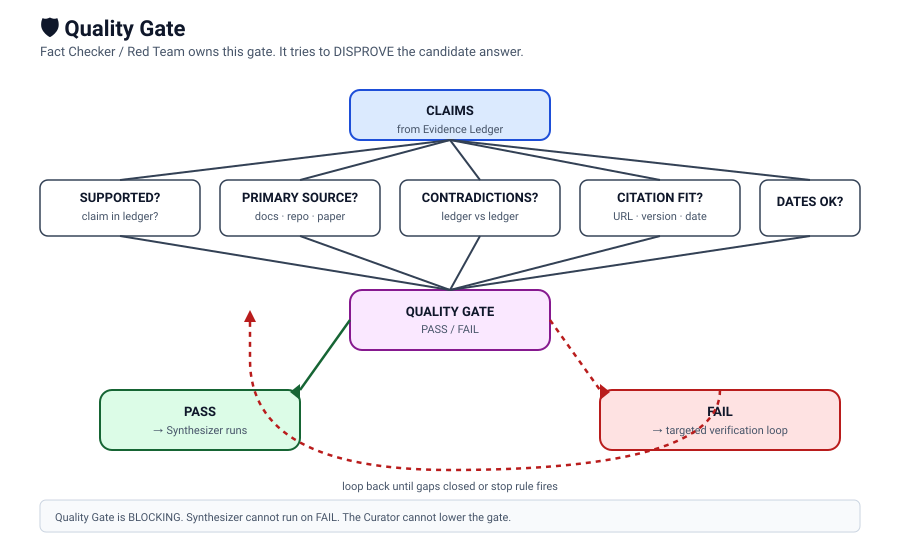

# Quality Gate

The Fact Checker / Red Team is the owner of the **blocking** Quality Gate. Its verdict (`PASS` or `FAIL`) decides whether the Synthesizer is allowed to publish the final answer.

The Fact Checker does **not** confirm conclusions. It tries to **disprove** them.



## Inputs

- The Evidence Ledger (Analyst output)
- The Candidate Pool and Source Graph (Scout / Hunter output)
- The user's question (from the Curator)

## What the Fact Checker checks

| Check | What it means |
|---|---|
| `unsupported claims` | claims in the draft that are not in the ledger |
| `citation mismatch` | citation URL does not actually say what the draft claims |
| `contradictions` | two ledger rows contradict each other and the draft picks one without justification |
| `date errors` | cited evidence was retrieved later than the publication, or publication is in the future (temporal anomaly) |
| `negative claims` | "X does not exist" without strong evidence |
| `marketing claims` | "best in class" without independent benchmark |
| `community-as-fact` | Reddit / forum posts used as a technical fact |
| `repository freshness` | `LAST_PUSH` / `LATEST_RELEASE` reused inconsistently |
| `model / API claims` | "supports GPT-5 / Claude 4.5 / etc." without checking provider docs |
| `semantic citation mismatch` | citation about A is used for claim about B |
| `Windows / local-cloud / own-models semantics` | wrong collapse or wrong classification |
| `absence vs NO` | absence-of-evidence collapsed into "NO" |

## Verdict shape

```
VERDICT: PASS  /  FAIL
SUMMARY: <one-line summary>
OPEN_GAPS:
  - <gap 1>
  - <gap 2>
TARGETED_TASKS:
  - Scout: <rewrite query 1>
  - Hunter: <open URL X>
  - Analyst: <extract passage Z>
```

## What `FAIL` triggers

The Curator does **not** lower the gate. The run is a loop:

```
Synthesizer -> FAILS to publish
       |
       v
Curator extracts gaps from the Fact Checker's TARGETED_TASKS
       |
       v
Curator dispatches targeted tasks to Scout / Hunter
       |
       v
Curator asks the Analyst for an updated ledger
       |
       v
Curator asks the Fact Checker again
       |
       v
PASS  -> Synthesizer
FAIL  -> loop (until completion criteria are met or STOP RULE fires)
```

The loop has a budget. When the budget is exhausted, the run returns `STATUS = DEGRADED` and the Curator chooses:

- `REASSIGN`
- `REDUCE SCOPE`
- `CONTINUE WITH CAVEAT`
- `STOP`

See [`group/fallback-policy.md`](../group/fallback-policy.md).

## Analyst DEGRADED fallback interaction

If the Analyst timed out and the Curator produced a degraded bridge package, the Fact Checker **must**:

- not promote any claim's confidence or status,
- if in doubt, return `FAIL` or `NOT VERIFIED`,
- record `ANALYST_STATUS: DEGRADED` in the audit summary.

## Completion criteria

A run is final only when **all** of the following are true:

- workstreams are closed,
- candidate pool was reranked and the shortlist was deep-read,
- gaps are closed or marked `NOT VERIFIED`,
- critical claims have supporting evidence,
- citations pass the five-step verification,
- no temporal anomalies remain,
- the Fact Checker returned `PASS`,
- the Synthesizer produced one final report with claim-level citations.

Until then, the run is `RESEARCH IN PROGRESS`, regardless of the round number.